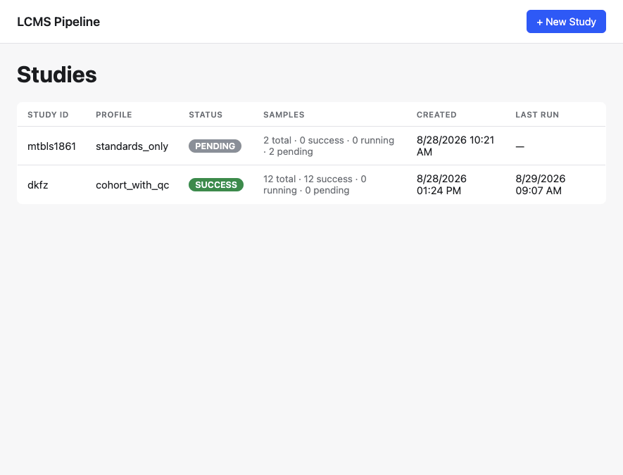
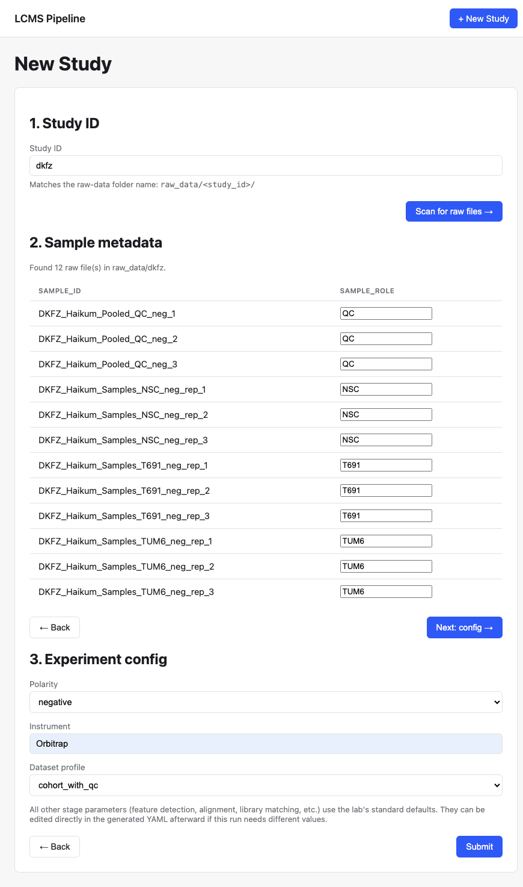
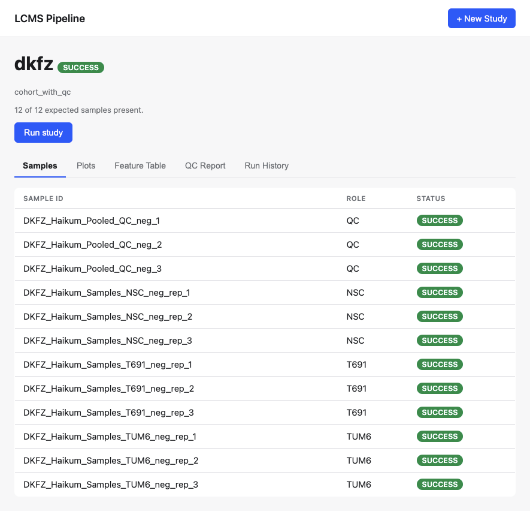
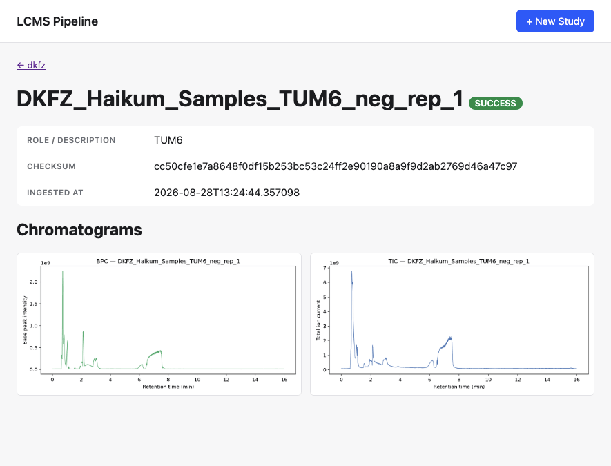

# Ionome

An LC-MS ionome pipeline with a shared core library, an analysis pipeline, and
a FastAPI web app for browsing studies, runs, and results.

## Layout

This is a [uv workspace](https://docs.astral.sh/uv/concepts/workspaces/) with
three installable packages plus supporting folders:

```
core/          ionome-core      shared settings, DB models, storage, paths
analysis/      ionome-analysis  the LC-MS processing pipeline (depends on core)
api/           ionome-api       FastAPI app + dashboard (depends on core & analysis)
config/        experiment YAML configs (not a Python package)
docs/          static GitHub Pages site (not a Python package, no build step)
```

Dependency direction: `core` → `analysis` → `api`.

## Screenshots

| Dashboard | New study wizard |
|---|---|
|  |  |

| Study detail | Sample detail |
|---|---|
|  |  |

See `docs/assets/screenshots/README.md` for what to capture in each.

## Setup

```bash
uv sync
cp .env.example .env   # then fill in the local paths / DB name for your machine
```

## Running the API

```bash
uv run --package ionome-api uvicorn api.main:app --reload
```

## Running the analysis pipeline

```bash
uv run --package ionome-analysis python -m analysis.pipeline_orchestrator <study_id>
```

`<study_id>` must match a `.yaml` filename under `YAML_DIR` (see `config/experiments/`
for examples), and a matching experiment record must already exist in the database.

## Docs

The `docs/` folder is a static site published via GitHub Pages — see
`docs/README.md` for how to preview or publish it.
